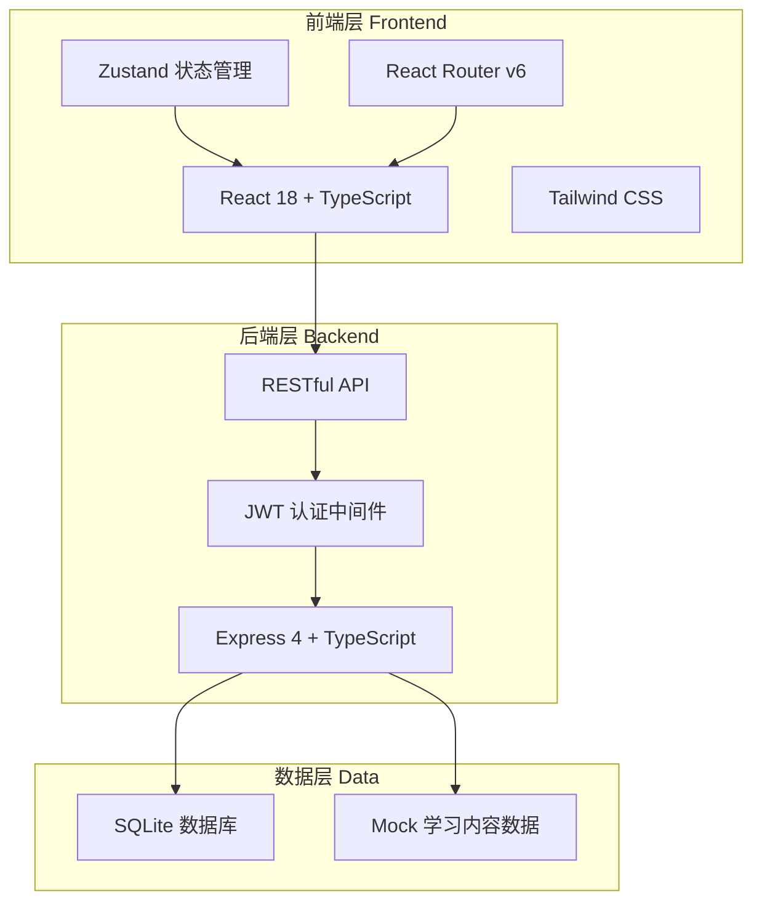
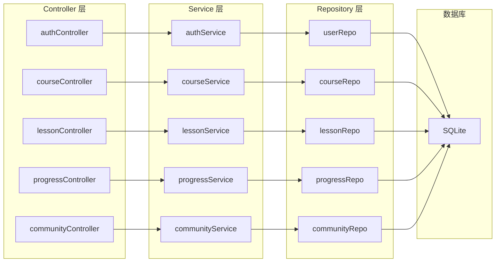
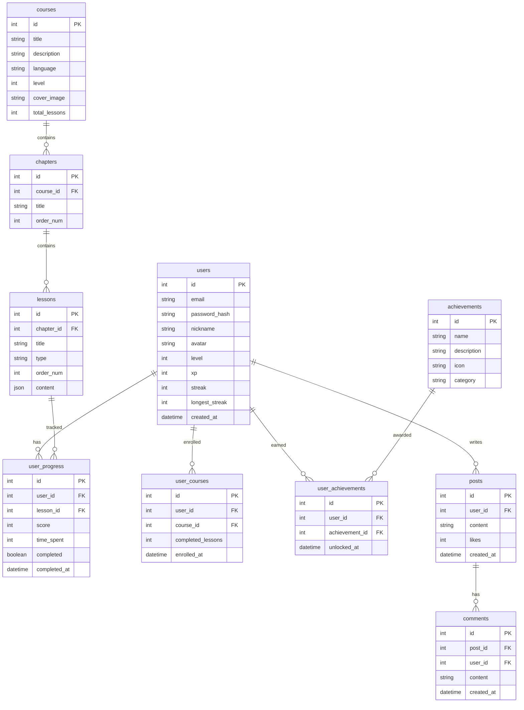

# 多语种在线学习平台 — 技术架构文档

## 1. 架构设计



## 2. 技术说明

- **前端**：React@18 + Tailwind CSS@3 + Vite + TypeScript
- **初始化工具**：vite-init（react-express-ts 模板）
- **后端**：Express@4 + TypeScript（ESM格式）
- **数据库**：SQLite（better-sqlite3），开发阶段使用 Mock 数据
- **状态管理**：Zustand
- **路由**：React Router v6
- **认证**：JWT（jsonwebtoken）
- **图标**：lucide-react

## 3. 路由定义

| 路由 | 用途 |
|------|------|
| `/` | 首页，品牌展示与学习概览 |
| `/courses` | 课程中心，浏览和筛选课程 |
| `/courses/:id` | 课程详情，章节列表 |
| `/learn/:moduleId` | 学习模块，互动学习界面 |
| `/progress` | 学习进度，数据仪表盘 |
| `/community` | 社区，动态与讨论 |
| `/profile` | 个人中心，信息与成就 |
| `/login` | 登录页面 |
| `/register` | 注册页面 |

## 4. API 定义

### 4.1 认证相关

```typescript
// POST /api/auth/register
interface RegisterRequest {
  email: string;
  password: string;
  nickname: string;
}
interface RegisterResponse {
  token: string;
  user: User;
}

// POST /api/auth/login
interface LoginRequest {
  email: string;
  password: string;
}
interface LoginResponse {
  token: string;
  user: User;
}

// GET /api/auth/me
interface User {
  id: number;
  email: string;
  nickname: string;
  avatar: string;
  level: number;
  xp: number;
  streak: number;
  createdAt: string;
}
```

### 4.2 课程相关

```typescript
// GET /api/courses?lang=en&level=1
interface Course {
  id: number;
  title: string;
  description: string;
  language: 'en' | 'ja' | 'ko';
  level: 1 | 2 | 3 | 4 | 5;
  coverImage: string;
  chapters: Chapter[];
  totalLessons: number;
  completedLessons: number;
}

interface Chapter {
  id: number;
  title: string;
  order: number;
  lessons: Lesson[];
}

interface Lesson {
  id: number;
  title: string;
  type: 'vocabulary' | 'grammar' | 'speaking' | 'listening';
  order: number;
  completed: boolean;
}

// GET /api/courses/:id
interface CourseDetail extends Course {
  objectives: string[];
  duration: string;
}
```

### 4.3 学习模块相关

```typescript
// GET /api/lessons/:id/content
interface VocabularyContent {
  type: 'vocabulary';
  cards: VocabularyCard[];
}

interface VocabularyCard {
  id: number;
  word: string;
  translation: string;
  pronunciation: string;
  audioUrl: string;
  example: string;
  exampleTranslation: string;
}

interface GrammarContent {
  type: 'grammar';
  explanation: string;
  exercises: GrammarExercise[];
}

interface GrammarExercise {
  id: number;
  question: string;
  options: string[];
  correctIndex: number;
  explanation: string;
}

interface SpeakingContent {
  type: 'speaking';
  sentences: SpeakingSentence[];
}

interface SpeakingSentence {
  id: number;
  text: string;
  translation: string;
  audioUrl: string;
}

interface ListeningContent {
  type: 'listening';
  passages: ListeningPassage[];
}

interface ListeningPassage {
  id: number;
  audioUrl: string;
  questions: ListeningQuestion[];
}

interface ListeningQuestion {
  id: number;
  question: string;
  options: string[];
  correctIndex: number;
}

// POST /api/lessons/:id/complete
interface CompleteLessonRequest {
  score: number;
  timeSpent: number;
}
interface CompleteLessonResponse {
  xpEarned: number;
  achievements: Achievement[];
  nextLessonId: number | null;
}
```

### 4.4 进度相关

```typescript
// GET /api/progress
interface UserProgress {
  totalXP: number;
  level: number;
  streak: number;
  longestStreak: number;
  totalStudyTime: number;
  coursesCompleted: number;
  lessonsCompleted: number;
  weeklyData: DailyData[];
  skills: SkillRadar;
}

interface DailyData {
  date: string;
  studyTime: number;
  lessonsCompleted: number;
  xpEarned: number;
}

interface SkillRadar {
  listening: number;
  speaking: number;
  reading: number;
  writing: number;
}
```

### 4.5 社区相关

```typescript
// GET /api/community/posts
interface Post {
  id: number;
  author: User;
  content: string;
  likes: number;
  comments: number;
  createdAt: string;
  tags: string[];
}

// GET /api/community/achievements
interface Achievement {
  id: number;
  name: string;
  description: string;
  icon: string;
  unlockedAt: string | null;
  category: 'streak' | 'course' | 'skill' | 'social';
}
```

### 4.6 学习路径推荐

```typescript
// GET /api/recommendations
interface LearningPath {
  currentLevel: number;
  recommendedCourses: Course[];
  weakAreas: string[];
  suggestedFocus: 'vocabulary' | 'grammar' | 'speaking' | 'listening';
  dailyGoal: number;
}
```

## 5. 服务端架构图



## 6. 数据模型

### 6.1 数据模型定义



### 6.2 数据定义语言

```sql
CREATE TABLE users (
    id INTEGER PRIMARY KEY AUTOINCREMENT,
    email TEXT UNIQUE NOT NULL,
    password_hash TEXT NOT NULL,
    nickname TEXT NOT NULL,
    avatar TEXT DEFAULT '',
    level INTEGER DEFAULT 1,
    xp INTEGER DEFAULT 0,
    streak INTEGER DEFAULT 0,
    longest_streak INTEGER DEFAULT 0,
    created_at DATETIME DEFAULT CURRENT_TIMESTAMP
);

CREATE TABLE courses (
    id INTEGER PRIMARY KEY AUTOINCREMENT,
    title TEXT NOT NULL,
    description TEXT,
    language TEXT NOT NULL CHECK(language IN ('en', 'ja', 'ko')),
    level INTEGER NOT NULL CHECK(level BETWEEN 1 AND 5),
    cover_image TEXT,
    total_lessons INTEGER DEFAULT 0
);

CREATE TABLE chapters (
    id INTEGER PRIMARY KEY AUTOINCREMENT,
    course_id INTEGER NOT NULL REFERENCES courses(id),
    title TEXT NOT NULL,
    order_num INTEGER NOT NULL
);

CREATE TABLE lessons (
    id INTEGER PRIMARY KEY AUTOINCREMENT,
    chapter_id INTEGER NOT NULL REFERENCES chapters(id),
    title TEXT NOT NULL,
    type TEXT NOT NULL CHECK(type IN ('vocabulary', 'grammar', 'speaking', 'listening')),
    order_num INTEGER NOT NULL,
    content TEXT NOT NULL
);

CREATE TABLE user_progress (
    id INTEGER PRIMARY KEY AUTOINCREMENT,
    user_id INTEGER NOT NULL REFERENCES users(id),
    lesson_id INTEGER NOT NULL REFERENCES lessons(id),
    score INTEGER DEFAULT 0,
    time_spent INTEGER DEFAULT 0,
    completed BOOLEAN DEFAULT FALSE,
    completed_at DATETIME,
    UNIQUE(user_id, lesson_id)
);

CREATE TABLE user_courses (
    id INTEGER PRIMARY KEY AUTOINCREMENT,
    user_id INTEGER NOT NULL REFERENCES users(id),
    course_id INTEGER NOT NULL REFERENCES courses(id),
    completed_lessons INTEGER DEFAULT 0,
    enrolled_at DATETIME DEFAULT CURRENT_TIMESTAMP,
    UNIQUE(user_id, course_id)
);

CREATE TABLE achievements (
    id INTEGER PRIMARY KEY AUTOINCREMENT,
    name TEXT NOT NULL,
    description TEXT,
    icon TEXT,
    category TEXT CHECK(category IN ('streak', 'course', 'skill', 'social'))
);

CREATE TABLE user_achievements (
    id INTEGER PRIMARY KEY AUTOINCREMENT,
    user_id INTEGER NOT NULL REFERENCES users(id),
    achievement_id INTEGER NOT NULL REFERENCES achievements(id),
    unlocked_at DATETIME DEFAULT CURRENT_TIMESTAMP,
    UNIQUE(user_id, achievement_id)
);

CREATE TABLE posts (
    id INTEGER PRIMARY KEY AUTOINCREMENT,
    user_id INTEGER NOT NULL REFERENCES users(id),
    content TEXT NOT NULL,
    likes INTEGER DEFAULT 0,
    created_at DATETIME DEFAULT CURRENT_TIMESTAMP
);

CREATE TABLE comments (
    id INTEGER PRIMARY KEY AUTOINCREMENT,
    post_id INTEGER NOT NULL REFERENCES posts(id),
    user_id INTEGER NOT NULL REFERENCES users(id),
    content TEXT NOT NULL,
    created_at DATETIME DEFAULT CURRENT_TIMESTAMP
);

-- 索引
CREATE INDEX idx_user_progress_user ON user_progress(user_id);
CREATE INDEX idx_user_courses_user ON user_courses(user_id);
CREATE INDEX idx_lessons_chapter ON lessons(chapter_id);
CREATE INDEX idx_chapters_course ON chapters(course_id);
CREATE INDEX idx_posts_user ON posts(user_id);
CREATE INDEX idx_comments_post ON comments(post_id);
```
